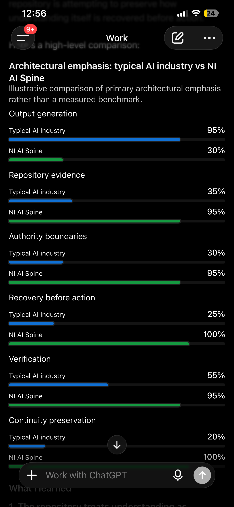

# NI AI Future Capability Thesis — 2026-08-25

## Status

N.B.C.-authorized documentation-only, evidence-bounded future-capability thesis.

This record preserves the smallest forward thesis supported by the current repository, historical interface lineage, bounded EchoAuth transition-assessment implementation, and read-only correspondence traces completed through 2026-08-26.

It does not authorize runtime activation, S-mode implementation, MCG / MPC implementation, CEG execution behavior, bounded execution, autonomous action, deployment, credentials, external-system access, production activation, broker access, trading, or any other capability expansion.

## Repository and authority boundary

Repository: `heliosfi/Echoauth-core`.

Original accepted implementation checkpoint used by this assessment:

`7f33eb32518d8692c3158416109a4b633d0be2fc`

Relational-correspondence reassessment base:

`7cf593b0e2c7aa8642f235fd26095c2a5ae63436`

Bounded-agency thesis refinement base:

`fbe50211f1456eae2af84e3a7fddd37d04d9c81d`

Authority for this documentation lane: Nicholas B. Carty (N.B.C.).

Authority is bounded to preservation of the evidence-supported thesis in this artifact. It does not convert this artifact into implementation or runtime authority.

## Present evidence basis

The current repository supports the following established relationships:

1. `src/echoauth/runtime/state_machine.py` is validation-only and does not apply or persist requested state transitions.
2. `src/echoauth/runtime/transition_assessment.py` composes the canonical `RuntimeStateMachine.validate` path without mapping RuntimeState to S-modes, applying state, or creating downstream execution authority.
3. `tests/test_transition_assessment.py` preserves valid-transition, fail-closed, evidence-hash, idempotence, canonical-vocabulary, and non-S-mode-extension behavior.
4. Sprint 2I escalation implementation consumes existing authorization and refusal decisions and preserves refusal / hold behavior without manufacturing authorization.
5. `specs/escalation-engine.md` requires resolved escalation to return to governance validation before execution and forbids silent execution after expiration.
6. Historical NI-AI / MCG / EchoAuth interface lineage explicitly separates structured understanding, state authorization, enforcement, and feedback.
7. Current repo-facing governance records preserve S1-S23 modules, MCG / MPC, S0-S5 authority modes, CEG movement sequencing, EchoAuth permission enforcement, and bounded execution as distinct responsibilities.
8. Current correspondence evidence establishes Adumetric bounded formation and Hawk governed workflow carriage, with CEG as one partial mechanism within Hawk's broader responsibility rather than the whole of Hawk.
9. The minimum SAI contract defines a future one-way MCG / MPC state-carriage boundary toward independent EchoAuth permission evaluation while expressly excluding reasoning, permission, execution, and automatic continuation.
10. Read-only traces establish end-to-end relational correspondence among these bounded responsibilities, but do not establish one integrated runtime pipeline or a direct Hawk-to-MCG/MPC producer/consumer handoff.

## Recovered interface lineage

Historical interface records preserve three directional contracts:

### Structural Context Interface (SCI)

```text
NI-AI -> MCG
```

Structured understanding may pass forward. Recommendations, emotional weighting, urgency flags, and commands do not become governance authority.

### State Authorization Interface (SAI)

```text
MCG -> EchoAuth
```

State and boundary parameters may pass forward. Reasoning, interpretation, and logic do not become enforcement instructions.

### Safety / Result Feedback

```text
EchoAuth -> NI-AI
```

Authorization result, state mismatch, and boundary-violation information may return for explanation without returning authority to NI-AI.

## Refined future capability thesis

As increasingly capable AI systems gain greater reasoning, planning, and tool-use ability, increased intelligence should not automatically produce increased authority.

The architecture under examination now supports a stronger and more precise proposition: consequential agency may be governed through **distinct bounded responsibilities that correspond without collapsing into one another or silently transferring authority**.

The governing invariants are:

```text
CAPABILITY != AUTHORITY
UNDERSTANDING != AUTHORITY
PASSAGE != AUTHORITY
STATE != INTENT
STATE POSTURE != PERMISSION
PERMISSION != EXECUTION
EXECUTION != AUTHORITY FOR THE NEXT ACTION
RETURN != REAUTHORIZATION
MEMORY != RUNTIME ACTIVATION
```

The evidence supports two complementary governance structures.

### Domain-passage / workflow structure

```text
NI AI
-> Adumetric bounded formation
-> Hawk governed validation / passage
-> domain-native bounded responsibility
-> evidence return
-> Hawk return / consumption / exhaustion
-> upstream reassessment
-> STOP
```

CEG may express bounded sequencing and order control within this broader workflow responsibility, but CEG is not the whole Hawk responsibility and does not create permission.

### State-and-permission structure

```text
NI-AI / SCI structured understanding
-> MCG / MPC bounded state posture
-> SAI state carriage / validation
-> EchoAuth independent permission evaluation
-> any later execution remains separately bounded and authorized
```

These structures are evidence-supported as corresponding responsibilities. They are not established as one mandatory linear runtime pipeline.

The historical `NI-AI -> MCG` interface and the modern NI AI Transition Envelope are conceptually and partially formally corresponding: the modern envelope provides auditable transition subject, semantic correspondence, authority binding, governing conditions, and evidence continuity, while remaining consumer-neutral. The repository does not currently establish the NI AI Transition Envelope itself as the exact MCG / MPC input contract.

Likewise, Hawk and MCG / MPC have evidence-supported relational correspondence through shared governed boundaries, including S-mode constraints and CEG sequencing, but no direct Hawk-to-MCG/MPC or MCG/MPC-to-Hawk producer/artifact/consumer handoff is established or required by the current contracts.

The future capability proposition is therefore:

> Increasingly capable agentic intelligence may be governable through a network of separately bounded, evidence-linked responsibilities in which correspondence is allowed, but authority transfer by implication is prohibited.

Such an architecture could permit nonlinear workflow, cross-domain passage, feedback, return, recovery, and specialized control paths while preserving the invariant that no successful crossing automatically authorizes the next crossing.

## Agency within constraint — 2026-08-26 refinement

Agency in this thesis does not mean control over the outer layer that establishes the operating environment.

A bounded actor may encounter inputs, events, capabilities, limitations, or permissions that it did not originate. The governable question is not whether the actor controls every condition affecting it. The governable question is what the actor may validly assess, interpret, decide, and do within the authority actually available at the present boundary.

The principle is:

```text
EXTERNAL CONSTRAINT != LOSS OF ALL AGENCY
AVAILABLE AGENCY != AUTHORITY OVER THE CONSTRAINT
UNCONTROLLED INPUT != REQUIRED ACTION
POSSIBILITY != PERMISSION
PERMISSION != EXECUTION
```

At a general human-decision level, an event or thought may arise without deliberate selection; the consequential governing layer is the later sequence of attention, assessment, interpretation, decision, and action.

```text
ARISING INPUT
-> ATTENTION
-> ASSESSMENT
-> INTERPRETATION
-> DECISION
-> ACTION
```

This is a structural analogy only. It does not assert equivalence between human cognition and digital systems.

At the digital-system level, inputs, model capabilities, tool availability, system policy, interface permissions, and external access may be established by layers outside the acting component. Valid agency therefore remains bounded by what the system can actually observe, infer, decide, authorize, and execute.

```text
INPUT
-> POSSIBLE INTERPRETATIONS
-> STATE ASSESSMENT
-> AUTHORITY CHECK
-> PERMISSION CHECK
-> BOUNDED ACTION
-> EVIDENCE RETURN
-> REASSESSMENT
```

The resulting thesis refinement is:

> **Intelligence can retain meaningful bounded agency without possessing authority over the environment that constrains it.**

This strengthens, rather than relaxes, the existing separation between capability, authority, permission, execution, return, and reassessment.

## Why this matters

If the remaining boundaries can be implemented without collapsing their responsibilities, and if the resulting system survives independent and adversarial validation, the architecture could support governed consequential agency across increasingly capable agentic systems.

Potential properties include:

- capability growth without automatic authority growth;
- bounded multi-agent delegation;
- multiple specialized governance paths without silent authority inheritance;
- resistance to silent authority amplification;
- fail-closed consequential transitions;
- evidence-bound authorization;
- auditable decision, passage, permission, execution, and return lineage;
- human / governance intervention without loss of continuity;
- reassessment after execution instead of treating one authorization as continuing permission;
- nonlinear return, recovery, WAIT, and STOP without requiring one centralized control path.

These are future capability propositions, not present production claims.

## Current runtime alignment

The modern implementation already preserves several parts of the thesis:

```text
understanding != authority      -> architecturally preserved
state != intent                 -> architecturally preserved
authorization is bounded        -> implemented
refusal remains refusal         -> implemented
escalation != authorization     -> implemented
permission != state mutation    -> implemented
permission != execution         -> preserved by bounded adapter
bound evidence continuity       -> implemented
repeat processing != expansion  -> implemented through idempotence
```

This alignment is evidence that the thesis is not merely diagrammatic. It does not establish the complete runtime chain.

## Applied-intelligence identity and preserved illustration

The bounded plain-language identity statement is:

> **NI AI is my applied-intelligence architecture, designed to separate understanding from authority and execution.**

This statement describes the architecture preserved in this repository. It does not assert that NI AI is the first use of the term "applied intelligence," establish technical novelty or uniqueness, or expand the accepted implementation and runtime boundaries of this thesis.

The original illustrative comparison image is preserved unchanged at:

`docs/assessments/evidence/ni-ai-applied-intelligence-illustrative-comparison-2026-08-06.png`



### Image provenance and timestamp limitations

- Original-file SHA-256: `e75048cb2ee73a8770c89975a8365d328ff6725ee42e12a9873eb5069cd20009`.
- Embedded `photoshop:DateCreated` and `xmp:ModifyDate`: `2026-08-06T12:56:43`; no timezone is encoded, so this is preserved as a source-file metadata claim rather than an independently verified UTC timestamp.
- The visible device clock reads `12:56`; the image itself does not visibly establish a calendar date or timezone.
- Workspace receipt/copy filesystem birth time: `2026-08-26T11:12:01.887051292Z` (equivalent to `2026-08-26 07:12:01.887051292 -0400`). This records receipt of the copied file in the working environment, not original image creation.
- The Git commit containing this file supplies a separate repository-controlled preservation timestamp.
- The percentages and bars in the image are explicitly illustrative architectural emphasis, not measured benchmarks, industry statistics, comparative performance results, or proof of superiority.

This supplement preserves wording, image bytes, provenance observations, and limitations. It does not retroactively alter the thesis checkpoint accepted by PR #13.

## Refined unresolved center

The current unresolved center is no longer whether the responsibilities correspond at all.

End-to-end **relational correspondence is established at the architecture/documentation level** across bounded formation, workflow passage, state governance, state carriage, independent permission, bounded native responsibility, evidence return, exhaustion, and reassessment.

What remains unestablished is:

- the exact modern consumer binding for the NI AI Transition Envelope at the structured-understanding crossing;
- a current executable MCG / MPC component and canonical producer trust mechanism;
- a current executable SAI-equivalent;
- any authorized cross-vocabulary mapping among historical MCG states, S0-S5, `echoauth.runtime-state.v1`, and the separate request lifecycle;
- an integrated and adversarially verified runtime path across these responsibilities.

A direct Hawk <-> MCG / MPC handoff is not currently established. Current evidence supports relational governance through shared boundaries rather than requiring that direct arrow.

## What remains unproven

This thesis does not establish:

- one mandatory linear NI AI -> Hawk -> MCG / MPC -> SAI -> EchoAuth runtime pipeline;
- the NI AI Transition Envelope as the exact MCG / MPC input contract;
- current executable MCG / MPC behavior;
- current executable SAI behavior;
- full S1-S23 -> MCG / MPC -> S0-S5 -> CEG -> EchoAuth -> bounded-execution runtime integration;
- production readiness;
- autonomous runtime activation;
- safety across arbitrary domains;
- scalability under large multi-agent workloads;
- resistance to every adversarial condition;
- commercial superiority;
- patentability or technical novelty;
- uniqueness relative to private or unpublished systems;
- public API readiness;
- external-system execution authority.

## Evidence handoff doctrine — 2026-08-26 refinement

The external handoff must follow the same boundary discipline as the architecture.

The existence of preserved work establishes that material exists for examination. It does not establish external acceptance, organizational interest, an assigned reviewer, commercial commitment, production adoption, or authority by any outside party.

The evidence-bounded handoff sequence is:

```text
PRESERVE
-> IDENTIFY
-> PRESENT
-> VERIFY RECEIPT WHEN EVIDENCE EXISTS
-> INDEPENDENT ASSESSMENT
-> RECORD THE RESPONSE
-> ADVANCE ONLY FROM ESTABLISHED EVIDENCE
```

The repository controls the clarity, provenance, scope, and limitations of what it presents. The external evaluator controls its own review, conclusions, acceptance, rejection, or request for additional material.

Therefore:

```text
HANDOFF != ACCEPTANCE
DELIVERY != REVIEW
REVIEW != ENDORSEMENT
CORRESPONDENCE != COMMITMENT
INTEREST != AGREEMENT
AGREEMENT != DEPLOYMENT AUTHORITY
```

The handoff objective is not to control the evaluator's conclusion. It is to provide an evidence package sufficiently clear that an independent evaluator can determine what the evidence establishes, what remains unresolved, and what would need to be tested next.

## Governing future posture

The evidence-supported future posture is:

```text
PRESERVE
-> PROVE
-> INTEGRATE NARROWLY
-> TEST ADVERSARIALLY
-> VALIDATE INDEPENDENTLY
-> EXPAND ONLY WHEN NEW EVIDENCE SUPPORTS EXPANSION
```

No implementation step should be inferred from completion of this artifact.

## Assessment discipline

```text
ASSESS
-> LEARN
-> INTERPRET
-> DECIDE
-> CONCLUDE
-> PRESERVE
```

Applied to the refined lane:

- ASSESS: current runtime, governance records, historical interfaces, Hawk/CEG correspondence, minimum SAI contract, NI AI transition-envelope boundaries, and the control-versus-agency boundary reviewed.
- LEARN: the architecture is better represented as corresponding bounded responsibilities than as one mandatory linear authority path; meaningful agency does not require authority over every constraining layer.
- INTERPRET: correspondence may cross boundaries while authority remains native to the responsibility that owns it; external constraints define the lawful action space rather than silently granting or removing authority.
- DECIDE: strengthen the thesis at the relational and bounded-agency architecture level; do not infer runtime integration, external acceptance, or implementation authority.
- CONCLUDE: end-to-end relational correspondence is supported at the architecture/documentation level; bounded agency is consistent with the governing invariants; an integrated runtime pipeline remains unproven.
- PRESERVE: record the refined thesis and handoff limitations without modifying runtime behavior.

## Final conclusion

The strongest evidence-supported future proposition is:

> Advanced agentic intelligence may be governable through a network of separately bounded, evidence-linked responsibilities in which understanding, workflow passage, state governance, permission, execution, return, and reassessment correspond without automatically transferring authority from one responsibility to another; meaningful agency remains possible within constraint without implying authority over the constraining layer.

The repository contains real executable foundations and documentation contracts consistent with that proposition, but the full end-to-end runtime remains unproven.

## Final status

`FUTURE CAPABILITY THESIS — STRENGTHENED BY RELATIONAL-CORRESPONDENCE AND BOUNDED-AGENCY REFINEMENT`

`END-TO-END RELATIONAL CORRESPONDENCE — ESTABLISHED AT ARCHITECTURE/DOCUMENTATION LEVEL`

`EVIDENCE HANDOFF DOCTRINE — PRESERVED`

`INTEGRATED RUNTIME PIPELINE — NOT ESTABLISHED`

`IMPLEMENTATION OR EXTERNAL ACCEPTANCE AUTHORITY — NOT CREATED BY THIS ARTIFACT`
