# Dependency Graph

## Component Dependencies

| Specification | Depends On | Provides |
|---|---|---|
| `echoauth-spec.md` | all component specs | top-level request contract |
| `identity-model.md` | none | identity record |
| `identity-resolution.md` | identity model, session model | identity verdict |
| `authority-registry.md` | identity model | authority records |
| `authority-revocation.md` | authority registry, delegation model, runtime envelope, execution token | revocation records |
| `authority-resolution.md` | identity resolution, authority registry, authority revocation, delegation model | authority verdict |
| `delegation-model.md` | authority registry | delegation grant |
| `delegation-validation.md` | delegation model, authority resolution, identity resolution | delegation validation result |
| `policy-registry.md` | none | policy versions |
| `policy-engine.md` | policy registry | policy decision |
| `policy-evaluation.md` | policy engine, authority resolution, delegation validation | policy decision reference |
| `invariant-validator.md` | policy evaluation, runtime envelope facts | invariant result |
| `runtime-envelope.md` | authority resolution, delegation validation, policy evaluation, invariant validator | runtime envelope |
| `execution-token.md` | runtime envelope | single-use execution token |
| `execution-claims.md` | execution token, runtime session model | executor claim |
| `runtime-state-machine.md` | authorization states, envelope, token, claims, halt model | canonical runtime state |
| `runtime-halt-model.md` | runtime state machine, refusal engine, recovery | halt/hold/refusal state |
| `refusal-engine.md` | policy evaluation, invariant validator, halt model | non-execution result |
| `escalation-engine.md` | authority registry, notification contracts | escalation routing |
| `runtime-recovery.md` | halt model, state machine, audit chain | recovery result |
| `runtime-session-model.md` | identity resolution | session state |
| `audit-record.md` | component outputs | audit event |
| `audit-log-spec.md` | audit record, audit chain | append-only storage |
| `audit-chain.md` | audit record | tamper-evident sequence |
| `event-bus.md` | all emitting components | event delivery |
| `notification-contracts.md` | event bus, escalation engine | notifications |
| `emergency-override-controls.md` | identity resolution, authority resolution, audit | emergency bounded override |
| `api-spec.md` | all public component contracts | API boundary |
| `security-model.md` | all components | security controls |

## Critical Path

```mermaid
flowchart LR
    ID["Identity Resolution"] --> AUTH["Authority Resolution"]
    AUTH --> DEL["Delegation Validation"]
    DEL --> POL["Policy Evaluation"]
    POL --> INV["Invariant Validator"]
    INV --> ENV["Runtime Envelope"]
    ENV --> TOK["Execution Token"]
    TOK --> CLAIM["Execution Claims"]
    CLAIM --> EXEC["Execution"]
    EXEC --> AUDIT["Audit Record / Chain"]
```

## Cross-Cutting Dependencies

- `security-model.md` applies to every component.
- `audit-record.md`, `audit-log-spec.md`, and `audit-chain.md` apply to every state transition.
- `event-bus.md` applies to every emitted lifecycle event.
- `notification-contracts.md` applies to escalation, halt, emergency, refusal, and recovery events.
- `authority-revocation.md` must be checked before authorization and before execution.
