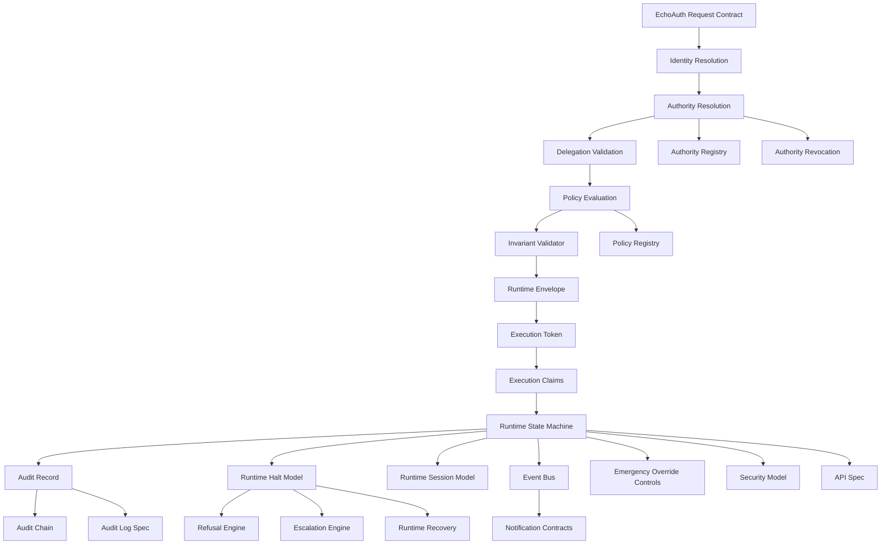

# Repository Architecture Map

## Specification Layers

## Repository Areas

| Area | Purpose | Status |
|---|---|---|
| `specs/` | Implementation-facing component contracts | Complete at specification structure level. |
| `governance/` | Governance foundation and authority principles | Populated. |
| `architecture/` | System overview and architecture placeholders | Partially populated. |
| `runtime/` | Runtime implementation guidance | Initial README only. |
| `src/echoauth/` | Python runtime stubs | Partial starter implementation. |
| `docs/` | Glossary, vision, use cases, readiness reports | Partially populated. |
| `patents/` | Patent support placeholders | Mostly empty. |
| `tests` | Test placeholder | Empty file, not usable test tree. |

## Implementation Sequence

1. Define schemas for all spec inputs and outputs.
2. Implement identity model and identity resolution.
3. Implement authority registry, revocation, and authority resolution.
4. Implement delegation model and delegation validation.
5. Implement policy registry, policy engine, and policy evaluation.
6. Implement invariant validator.
7. Implement runtime envelope, execution token, and execution claims.
8. Implement runtime state machine, halt/refusal/escalation/recovery.
9. Implement audit record, audit log, and audit chain.
10. Implement event bus and notification contracts.
11. Add conformance tests and CI.
