# Runtime Dependency Graph

```mermaid
flowchart TD
    Runtime["EchoAuthRuntime"]
    Identity["IdentityService"]
    Authority["AuthorityService"]
    Delegation["DelegationService"]
    Policy["PolicyService"]
    Refusal["RefusalService"]
    Invariant["InvariantService"]
    Escalation["EscalationService"]
    Envelope["EnvelopeService"]
    Token["TokenService"]
    Claim["ExecutionClaimService"]
    Halt["HaltService"]
    Recovery["RecoveryService"]
    Emergency["EmergencyOverrideService"]
    Notification["NotificationService"]
    Audit["AuditService"]
    EventBus["EventBus"]
    CommonSchemas["Common Contract Types"]
    Decisions["Decision Log"]
    Ambiguities["Resolved Ambiguity Register"]

    AuthorityRegistry["AuthorityRegistryRepository"]
    RevocationRepo["RevocationRepository"]
    DelegationRepo["DelegationRepository"]
    PolicyRepo["PolicyRegistryRepository"]
    RuntimeRepo["RuntimeStateRepository"]
    AuditRepo["AuditLogRepository"]

    Runtime --> Identity
    Runtime --> Authority
    Runtime --> Delegation
    Runtime --> Policy
    Runtime --> Refusal
    Runtime --> Invariant
    Runtime --> Escalation
    Runtime --> Envelope
    Runtime --> Token
    Runtime --> Claim
    Runtime --> Halt
    Runtime --> Recovery
    Runtime --> Emergency
    Runtime --> Notification
    Runtime --> Audit

    Authority --> AuthorityRegistry
    Authority --> RevocationRepo
    Delegation --> DelegationRepo
    Policy --> PolicyRepo
    Recovery --> RuntimeRepo
    Audit --> AuditRepo
    Audit --> EventBus
    Notification --> EventBus

    Runtime --> CommonSchemas
    Identity --> CommonSchemas
    Authority --> CommonSchemas
    Delegation --> CommonSchemas
    Policy --> CommonSchemas
    Refusal --> CommonSchemas
    Invariant --> CommonSchemas
    Escalation --> CommonSchemas
    Emergency --> CommonSchemas
    Audit --> CommonSchemas
    EventBus --> CommonSchemas
    CommonSchemas --> Decisions
    CommonSchemas --> Ambiguities
```

| Edge | Contract Source |
| --- | --- |
| `EchoAuthRuntime -> IdentityService` | `contracts/service-contracts.yaml`; `specs/identity-resolution.md` |
| `EchoAuthRuntime -> AuthorityService` | `contracts/service-contracts.yaml`; `specs/authority-resolution.md` |
| `EchoAuthRuntime -> DelegationService` | `contracts/service-contracts.yaml`; `specs/delegation-validation.md` |
| `EchoAuthRuntime -> PolicyService` | `contracts/service-contracts.yaml`; `specs/policy-evaluation.md` |
| `EchoAuthRuntime -> RefusalService` | `contracts/service-contracts.yaml`; `specs/refusal-engine.md` |
| `EchoAuthRuntime -> InvariantService` | `contracts/service-contracts.yaml`; `specs/invariant-validator.md` |
| `EchoAuthRuntime -> EscalationService` | `contracts/service-contracts.yaml`; `specs/escalation-engine.md` |
| `EchoAuthRuntime -> EnvelopeService` | `contracts/service-contracts.yaml`; `specs/runtime-envelope.md` |
| `EchoAuthRuntime -> TokenService` | `contracts/service-contracts.yaml`; `specs/execution-token.md` |
| `EchoAuthRuntime -> ExecutionClaimService` | `contracts/service-contracts.yaml`; `specs/execution-claims.md` |
| `EchoAuthRuntime -> HaltService` | `contracts/service-contracts.yaml`; `specs/runtime-halt-model.md` |
| `EchoAuthRuntime -> RecoveryService` | `contracts/service-contracts.yaml`; `specs/runtime-recovery.md` |
| `EchoAuthRuntime -> EmergencyOverrideService` | `contracts/service-contracts.yaml`; `specs/emergency-override-controls.md` |
| `EchoAuthRuntime -> NotificationService` | `contracts/integration-contracts.yaml`; `specs/notification-contracts.md` |
| `EchoAuthRuntime -> AuditService` | `contracts/service-contracts.yaml`; `specs/audit-record.md` |
| `AuditService -> EventBus` | `events/event-catalog.yaml`; `specs/event-bus.md` |
| `NotificationService -> EventBus` | `events/event-catalog.yaml`; `specs/notification-contracts.md` |
| Runtime components -> common contract types | `schemas/common.schema.json`; `contracts/ambiguities.md`; `contracts/decision-log.md` |
