# Final Implementation Readiness Report

# 1. Executive Summary

EchoAuth is ready for implementation with documented exceptions.

The repository now contains implementation-facing specifications, generated
contracts, schema artifacts, a reference runtime interface skeleton, resolved
contract ambiguity decisions, runtime traceability, and dependency mapping. The
runtime package intentionally contains no governance decisions, authorization
logic, policy logic, audit-chain implementation, persistence adapter, API
server, or execution behavior.

Evidence:

- `runtime/final-repository-readiness-assessment.md`
- `runtime/coverage-report.md`
- `runtime/traceability-matrix.md`
- `runtime/dependency-graph.md`
- `contracts/ambiguities.md`
- `contracts/decision-log.md`
- `contracts/ambiguity-resolution-report.md`

# 2. Architecture Map

Evidence source: `runtime/dependency-graph.md`.

```mermaid
flowchart TD
    Runtime["EchoAuthRuntime"]
    Identity["IdentityService"]
    Authority["AuthorityService"]
    Delegation["DelegationService"]
    Policy["PolicyService"]
    Refusal["RefusalService"]
    Invariant["InvariantService"]
    Escalation["EscalationService"]
    Envelope["EnvelopeService"]
    Token["TokenService"]
    Claim["ExecutionClaimService"]
    Halt["HaltService"]
    Recovery["RecoveryService"]
    Emergency["EmergencyOverrideService"]
    Notification["NotificationService"]
    Audit["AuditService"]
    EventBus["EventBus"]
    CommonSchemas["Common Contract Types"]

    Runtime --> Identity
    Runtime --> Authority
    Runtime --> Delegation
    Runtime --> Policy
    Runtime --> Refusal
    Runtime --> Invariant
    Runtime --> Escalation
    Runtime --> Envelope
    Runtime --> Token
    Runtime --> Claim
    Runtime --> Halt
    Runtime --> Recovery
    Runtime --> Emergency
    Runtime --> Notification
    Runtime --> Audit
    Audit --> EventBus
    Notification --> EventBus
    Runtime --> CommonSchemas
```

# 3. Contract Inventory

| Artifact | Purpose | Evidence |
| --- | --- | --- |
| `api/openapi.yaml` | Runtime HTTP API contract. | OpenAPI contract inventory. |
| `contracts/protobuf/echoauth.proto` | Protobuf service/message contract. | Protobuf contract inventory. |
| `contracts/service-contracts.yaml` | Service inputs, outputs, dependencies, terminal states, and canonical data contracts. | Runtime service boundary evidence. |
| `contracts/integration-contracts.yaml` | API, event bus, persistence, and protobuf integration controls. | Integration boundary evidence. |
| `contracts/ambiguities.md` | Resolved ambiguity register. | Ambiguity resolution evidence. |
| `contracts/decision-log.md` | Canonical decisions and rationale. | Decision traceability evidence. |
| `contracts/ambiguity-resolution-report.md` | Summary of ambiguity resolution updates. | Due-diligence evidence. |
| `events/event-catalog.yaml` | Event type catalog and payload schema selection. | Event contract evidence. |
| `events/event-envelope.schema.json` | Event envelope schema. | Event validation evidence. |
| `database/schema.sql` | Persistence schema contract. | Storage boundary evidence. |

# 4. Schema Inventory

| Schema | Scope | Key Contract Types |
| --- | --- | --- |
| `schemas/common.schema.json` | Shared contract definitions. | `CanonicalJsonObject`, `StringReferenceList`, `ValidationErrorList`, `RuntimeState`, `ActorType`, `AuthorityType`, `Timestamp`. |
| `schemas/echoauth-request.schema.json` | Runtime request input. | Request identifiers, actor/subject/action/resource, canonical `payload`, canonical `context`, correlation and idempotency fields. |
| `schemas/authority-resolution.schema.json` | Authority resolution request. | Request identifiers, action/resource, canonical `context`, authority/delegation/revocation record arrays. |
| `schemas/audit-record.schema.json` | Audit event append input. | Event type, actor, state fields, reason, canonical `details`, timestamp. |
| `schemas/runtime-envelope.schema.json` | Runtime envelope. | Envelope/request/authority identifiers, action/resource, payload hash, policy/invariant versions, channel, nonce, expiry, audit sink. |
| `schemas/execution-token.schema.json` | Execution token. | Token/envelope/request identifiers, action/resource, payload hash, nonce, issued/expiry timestamps, issuer. |
| `events/event-envelope.schema.json` | Event bus envelope. | Event identifiers, producer, correlation, canonical payload, timestamp. |

# 5. Runtime Package Inventory

Evidence source: `runtime/coverage-report.md` and `src/echoauth`.

| Runtime Area | Artifact | Status |
| --- | --- | --- |
| Package root | `src/echoauth/__init__.py` | Exports runtime skeleton interfaces and models. |
| Runtime boundary | `src/echoauth/main.py` | Abstract runtime and dependency container. |
| Interfaces | `src/echoauth/interfaces.py` | Abstract services for runtime, identity, authority, delegation, policy, refusal, invariant, escalation, envelope, token, claims, halt, recovery, override, notification, and audit. |
| Models | `src/echoauth/models.py` | Contract dataclasses and enums. |
| Repositories | `src/echoauth/repositories.py` | Abstract persistence boundaries. |
| Event bus | `src/echoauth/events.py` | Abstract publish/subscribe boundary and event envelope. |
| Configuration | `src/echoauth/config.py` | Contract paths and runtime configuration shape. |
| Wiring | `src/echoauth/wiring.py` | Declarative runtime dependency edges. |
| Auth package | `src/echoauth/auth/` | Authority, delegation, and runtime state interface exports. |
| Policy package | `src/echoauth/policy/` | Policy and refusal interface exports. |
| Governance package | `src/echoauth/governance/` | Escalation and invariant interface exports. |
| Audit package | `src/echoauth/audit/` | Audit interface exports. |
| Execution package | `src/echoauth/execution/` | Token and execution-claim interface exports. |

# 6. Traceability Matrix

Evidence source: `runtime/traceability-matrix.md`.

| Specification Group | Contract Artifacts | Runtime Interfaces |
| --- | --- | --- |
| Runtime request processing | `api/openapi.yaml`; `contracts/service-contracts.yaml`; `contracts/protobuf/echoauth.proto` | `RuntimeService`; `EchoAuthRuntime`; `EchoAuthRuntimeDependencies` |
| Identity | `schemas/common.schema.json`; `api/openapi.yaml`; `contracts/protobuf/echoauth.proto` | `IdentityService`; `IdentityResolutionRequest`; `IdentityVerdict` |
| Authority | `schemas/authority-resolution.schema.json`; `contracts/service-contracts.yaml`; `contracts/protobuf/echoauth.proto` | `AuthorityService`; `AuthorityResolutionRequest`; `AuthorityVerdict`; `AuthorityRegistryRepository`; `RevocationRepository` |
| Delegation | `contracts/service-contracts.yaml`; `database/schema.sql`; `contracts/ambiguities.md`; `contracts/decision-log.md` | `DelegationService`; `DelegationRepository` |
| Policy and refusal | `contracts/service-contracts.yaml`; `database/schema.sql`; `contracts/ambiguities.md`; `contracts/decision-log.md` | `PolicyService`; `RefusalService`; `PolicyRegistryRepository` |
| Governance | `contracts/service-contracts.yaml`; `contracts/ambiguities.md` | `InvariantService`; `EscalationService`; `EmergencyOverrideService` |
| Runtime envelope and execution | `schemas/runtime-envelope.schema.json`; `schemas/execution-token.schema.json`; `contracts/service-contracts.yaml`; `contracts/protobuf/echoauth.proto` | `EnvelopeService`; `TokenService`; `ExecutionClaimService`; `HaltService`; `RecoveryService` |
| Audit | `schemas/audit-record.schema.json`; `database/schema.sql`; `events/event-catalog.yaml` | `AuditService`; `AuditRecord`; `AuditLogRepository` |
| Events and notifications | `events/event-envelope.schema.json`; `events/event-catalog.yaml`; `contracts/integration-contracts.yaml` | `EventBus`; `EventEnvelope`; `NotificationService` |
| Ambiguity resolution | `contracts/ambiguities.md`; `contracts/ambiguity-resolution-report.md`; `contracts/decision-log.md` | `CanonicalJsonObject`; `StringReferenceList`; `ValidationErrorList` |

# 7. Dependency Graph

Evidence source: `runtime/dependency-graph.md`.

| Edge | Contract Source |
| --- | --- |
| `EchoAuthRuntime -> IdentityService` | `contracts/service-contracts.yaml`; `specs/identity-resolution.md` |
| `EchoAuthRuntime -> AuthorityService` | `contracts/service-contracts.yaml`; `specs/authority-resolution.md` |
| `EchoAuthRuntime -> DelegationService` | `contracts/service-contracts.yaml`; `specs/delegation-validation.md` |
| `EchoAuthRuntime -> PolicyService` | `contracts/service-contracts.yaml`; `specs/policy-evaluation.md` |
| `EchoAuthRuntime -> RefusalService` | `contracts/service-contracts.yaml`; `specs/refusal-engine.md` |
| `EchoAuthRuntime -> InvariantService` | `contracts/service-contracts.yaml`; `specs/invariant-validator.md` |
| `EchoAuthRuntime -> EscalationService` | `contracts/service-contracts.yaml`; `specs/escalation-engine.md` |
| `EchoAuthRuntime -> EnvelopeService` | `contracts/service-contracts.yaml`; `specs/runtime-envelope.md` |
| `EchoAuthRuntime -> TokenService` | `contracts/service-contracts.yaml`; `specs/execution-token.md` |
| `EchoAuthRuntime -> ExecutionClaimService` | `contracts/service-contracts.yaml`; `specs/execution-claims.md` |
| `EchoAuthRuntime -> HaltService` | `contracts/service-contracts.yaml`; `specs/runtime-halt-model.md` |
| `EchoAuthRuntime -> RecoveryService` | `contracts/service-contracts.yaml`; `specs/runtime-recovery.md` |
| `EchoAuthRuntime -> EmergencyOverrideService` | `contracts/service-contracts.yaml`; `specs/emergency-override-controls.md` |
| `EchoAuthRuntime -> NotificationService` | `contracts/integration-contracts.yaml`; `specs/notification-contracts.md` |
| `EchoAuthRuntime -> AuditService` | `contracts/service-contracts.yaml`; `specs/audit-record.md` |
| `AuditService -> EventBus` | `events/event-catalog.yaml`; `specs/event-bus.md` |
| `NotificationService -> EventBus` | `events/event-catalog.yaml`; `specs/notification-contracts.md` |
| Runtime components -> common contract types | `schemas/common.schema.json`; `contracts/ambiguities.md`; `contracts/decision-log.md` |

# 8. Resolved Ambiguities

Evidence source: `contracts/ambiguities.md`.

| Contract Type | Fields | Resolution |
| --- | --- | --- |
| `CanonicalJsonObject` | `payload`, `context`, `details`, `evidence`, `scope`, `rules`, `facts`, `credential_set`, `context_constraints`, `effective_scope` | Use canonical JSON objects. Nested business schemas are not generated. |
| `StringReferenceList` | `credential_refs`, `role_refs` | Use ordered lists of stable string references. |
| `ValidationErrorList` | `validation_errors` | Use ordered lists of validation failure codes or messages. |

# 9. Remaining Implementation Exceptions

Evidence source: `runtime/final-repository-readiness-assessment.md` and
`runtime/coverage-report.md`.

| Exception | Severity | Affected Contracts | Affected Runtime Components | Can implementation proceed before resolution? |
| --- | --- | --- | --- | --- |
| Nested schemas for domain-specific canonical JSON objects are not generated. | Medium | `schemas/common.schema.json`; `api/openapi.yaml`; `contracts/protobuf/echoauth.proto`; `database/schema.sql`; `events/event-envelope.schema.json`; `events/event-catalog.yaml`; `contracts/service-contracts.yaml`; `contracts/integration-contracts.yaml` | `IdentityService`; `AuthorityService`; `DelegationService`; `PolicyService`; `RefusalService`; `InvariantService`; `EscalationService`; `EmergencyOverrideService`; `AuditService`; `EventBus`; `NotificationService` | Yes. Proceed with canonical object validation, canonical serialization, hashing, required-field enforcement, and interface/adaptor implementation. Do not implement nested domain behavior without future specifications. |
| Protobuf canonical objects remain `google.protobuf.Struct`. | Low | `contracts/protobuf/echoauth.proto`; `contracts/integration-contracts.yaml` | Protobuf adapters for runtime, identity, authority, audit, event, and execution boundaries. | Yes. Proceed with `Struct` mapping and apply canonical serialization/hashing outside the wire type. |
| Database JSON validation is not engine-specific. | Medium | `database/schema.sql`; `contracts/integration-contracts.yaml`; `contracts/service-contracts.yaml` | Repository adapters for request, authority, delegation, policy, runtime state, audit log, events, and notifications. | Yes. Proceed by enforcing canonical JSON text at repository boundaries for the selected database engine. Do not assume database-native JSON validation unless an adapter documents it. |
| Concrete implementation adapters are absent. | High | `api/openapi.yaml`; `contracts/service-contracts.yaml`; `contracts/integration-contracts.yaml`; `events/event-catalog.yaml`; `database/schema.sql` | All abstract service, repository, event bus, API, persistence, cryptographic, and audit-chain boundaries. | Yes. This is the intended first implementation work. The runtime skeleton defines interfaces only. |
| Future nested domain schemas, if desired, are absent. | Low | `schemas/common.schema.json`; `contracts/ambiguities.md`; `contracts/decision-log.md` | Components that inspect domain-specific payload, evidence, scope, credential, fact, or policy-rule internals. | Yes. Not required for first build unless the first build scope includes domain-specific nested validation. |

# 10. First-Build Roadmap

Evidence source: runtime package inventory, `contracts/service-contracts.yaml`,
`contracts/integration-contracts.yaml`, `database/schema.sql`, and
`events/event-catalog.yaml`.

| Phase | Build Work | Required Evidence Artifacts | Exit Criteria |
| --- | --- | --- | --- |
| 1 | Package and contract validation harness. | `src/echoauth`; `schemas/*.json`; `api/openapi.yaml`; `contracts/*.yaml`; `contracts/protobuf/echoauth.proto` | Local validation runs for Python imports, JSON schemas, OpenAPI structure, protobuf syntax, and YAML parsing. |
| 2 | Repository adapters. | `src/echoauth/repositories.py`; `database/schema.sql`; `contracts/integration-contracts.yaml` | Concrete repositories persist and retrieve canonical records without adding governance decisions. |
| 3 | Event bus adapter. | `src/echoauth/events.py`; `events/event-envelope.schema.json`; `events/event-catalog.yaml` | Event envelopes validate, publish, subscribe, and preserve correlation/causation fields. |
| 4 | Audit append adapter. | `src/echoauth/interfaces.py`; `src/echoauth/audit/logging.py`; `schemas/audit-record.schema.json`; `database/schema.sql` | Audit records append through the interface and persist hash-bound fields required by contracts. |
| 5 | Service adapter shells. | `contracts/service-contracts.yaml`; `src/echoauth/interfaces.py`; `src/echoauth/main.py` | Runtime dependencies can be injected and invoked through abstract interfaces with contract-shaped inputs and outputs. |
| 6 | API adapter. | `api/openapi.yaml`; `contracts/integration-contracts.yaml`; `src/echoauth/main.py` | HTTP handlers bind OpenAPI operations to runtime service interfaces without embedding business logic. |
| 7 | Protobuf adapter. | `contracts/protobuf/echoauth.proto`; `contracts/integration-contracts.yaml`; `src/echoauth/models.py` | Protobuf messages map to runtime contract models, preserving canonical JSON object fields as `Struct`. |
| 8 | Deterministic processing tests. | `specs/runtime-state-machine.md`; `contracts/service-contracts.yaml`; `contracts/decision-log.md`; `runtime/traceability-matrix.md` | Tests verify state names, terminal states, canonical object handling, idempotency fields, nonce uniqueness constraints, and audit/event correlation fields. |

# Final Assessment

Ready for implementation with documented exceptions.

The repository supports first-build engineering work for adapters, validation,
persistence, eventing, API binding, protobuf binding, and audit append
infrastructure. Remaining exceptions do not block implementation because they
are explicitly bounded by existing artifacts: implement canonical object/list
handling now, and defer nested domain behavior unless future specifications
define it.
